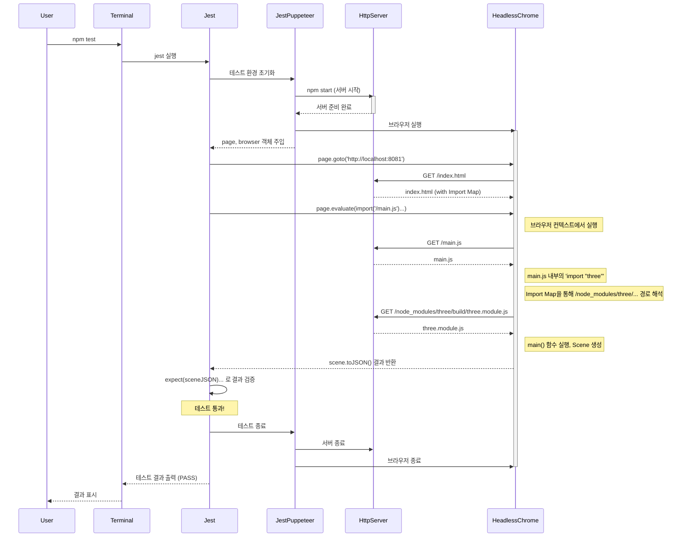

# 3D 기능 구현과 Headless WebGL 유닛 테스트

이 프로젝트는 `three.js`를 사용하여 기본적인 3D 씬을 구현하고, `Jest`와 `Puppeteer`를 이용해 Headless 환경에서 WebGL 유닛 테스트를 작성하고 실행하는 과정을 보여주기 위해 만들어졌습니다.

이 과정을 통해 GUI 없이 서버 환경(예: CI/CD 파이프라인)에서 3D 그래픽 렌더링 코드를 자동으로 검증하는 'Headless WebGL 유닛 테스트'의 핵심 개념과 실제 구현 방법을 이해하는 것을 목표로 합니다.

##  목차
- [핵심 개념: Headless WebGL 유닛 테스트란?](#핵심-개념-headless-webgl-유닛-테스트란)
- [프로젝트 구조](#프로젝트-구조)
- [설치 및 실행](#설치-및-실행)
- [기술적 상세 설명](#기술적-상세-설명)
- [테스트 실행 흐름 (Flow Diagram)](#테스트-실행-흐름-flow-diagram)
- [문제 해결 과정 (Troubleshooting)](#문제-해결-과정-troubleshooting)

## 핵심 개념: Headless WebGL 유닛 테스트란?

Headless WebGL 유닛 테스트는 그래픽 사용자 인터페이스(GUI)가 없는 환경에서 WebGL 기반의 3D 그래픽 코드를 테스트하는 자동화된 방법입니다.

- **Headless Browser**: Puppeteer와 같은 도구를 사용하여 실제 브라우저(Chrome)를 화면에 보이지 않는 모드로 실행합니다. 이를 통해 실제 브라우저의 렌더링 엔진과 API(WebGL 포함)를 그대로 사용할 수 있습니다.
- **코드 검증**: 3D 씬이 올바르게 구성되었는지 (예: 객체가 추가되었는지), 객체의 속성(위치, 색상 등)이 올바른지, 특정 애니메이션이 정확하게 동작하는지 등을 코드로 검증합니다.
- **자동화**: 이 모든 과정을 스크립트로 자동화하여, 코드 변경 시마다 3D 기능의 회귀 버그를 자동으로 찾아낼 수 있습니다. 이는 CI/CD 파이프라인에 통합하기에 매우 유용합니다.

## 프로젝트 구조

```
/
├── node_modules/
├── index.html            # 3D 씬을 렌더링할 기본 HTML 페이지, Import Map 포함
├── main.js               # Three.js를 사용해 큐브를 렌더링하는 핵심 3D 로직
├── main.test.js          # Jest와 Puppeteer를 사용한 유닛 테스트 코드
├── jest-puppeteer.config.js # Jest-Puppeteer 설정 파일 (서버, 브라우저 설정)
├── package.json          # 프로젝트 의존성 및 스크립트 정의
└── README.md             # 프로젝트 설명서
```

## 설치 및 실행

### 1. 의존성 설치

```bash
npm install
```
> **참고**: `puppeteer` 설치 시 Chrome 브라우저를 다운로드하는 과정에서 네트워크 문제나 프록시/인증서 오류가 발생할 수 있습니다. 이 프로젝트는 로컬에 설치된 Chrome을 사용하도록 설정되었으므로, `PUPPETEER_SKIP_DOWNLOAD=true` 환경 변수를 사용하여 다운로드를 건너뛸 수 있습니다.

### 2. 테스트 실행

```bash
npm test
```

이 명령어를 실행하면 `jest-puppeteer`가 다음을 자동으로 수행합니다.
1. `http-server`로 로컬 웹 서버를 시작합니다.
2. Headless Chrome 브라우저를 실행합니다.
3. `main.test.js`에 작성된 테스트를 실행합니다.
4. 테스트가 완료되면 서버와 브라우저를 모두 종료합니다.

## 기술적 상세 설명

이 프로젝트는 최신 웹 기술을 사용하여 Headless WebGL 테스트를 구현하며, 몇 가지 중요한 기술적 문제를 해결하는 과정을 포함합니다.

### 1. 테스트 서버 (`http-server`)
브라우저는 보안상의 이유로 `file://` 프로토콜을 통해 로드된 로컬 파일에서 ES6 모듈을 가져오는 것을 제한합니다(CORS 정책). 이 문제를 해결하기 위해 `http-server`를 사용하여 프로젝트 파일을 `http://` 프로토콜로 제공합니다.

### 2. 테스트 환경 통합 (`jest-puppeteer`)
`jest-puppeteer`는 `Jest`와 `Puppeteer`를 매끄럽게 연동하는 핵심적인 역할을 합니다. `jest-puppeteer.config.js` 설정에 따라, 테스트 시작 시 `command: 'npm start'`로 정의된 서버를 자동으로 실행하고, 테스트가 끝나면 종료해줍니다. 또한 각 테스트 파일에 `page`, `browser`와 같은 Puppeteer 객체를 전역으로 주입하여 편리하게 사용할 수 있게 해줍니다.

### 3. ES6 모듈 해석 (`Import Maps`)
`main.js` 파일은 `import * as THREE from 'three';` 구문을 사용하여 `three.js` 라이브러리를 가져옵니다. 하지만 브라우저는 `'three'`와 같은 bare module specifier(패키지 이름)를 어떻게 해석해야 할지 모릅니다.

이 문제를 해결하기 위해 `index.html`에 **Import Map**을 사용합니다.
```html
<script type="importmap">
  {
    "imports": {
      "three": "/node_modules/three/build/three.module.js"
    }
  }
</script>
```
Import Map은 브라우저에게 `'three'`라는 모듈을 어느 경로의 파일에서 불러와야 하는지 알려주는 역할을 합니다. 이로써 `node_modules`에 설치된 패키지를 브라우저에서 직접 사용할 수 있게 됩니다.

### 4. 테스트 로직 (`main.test.js`)
테스트의 핵심은 `page.evaluate()` 함수를 통해 브라우저 컨텍스트에서 코드를 실행하는 것입니다.

```javascript
const sceneJSON = await page.evaluate(async () => {
  // 1. 브라우저 환경에서 main.js 모듈을 동적으로 import
  const { main } = await import('/main.js');
  // 2. main 함수를 실행하여 scene 객체를 생성
  const scene = main();
  // 3. scene 객체를 JSON으로 직렬화하여 반환
  return scene.toJSON();
});
```
이 코드는 Headless 브라우저 내에서 `main.js`를 동적으로 로드하고 실행하여, 그 결과물인 `scene` 객체를 가져옵니다. 가져온 `sceneJSON` 데이터를 `expect` 구문을 사용하여 검증함으로써 3D 로직이 의도대로 동작했는지 확인합니다.

## 테스트 실행 흐름 (Flow Diagram)



## 문제 해결 과정 (Troubleshooting)

이 프로젝트를 진행하면서 실제 개발 환경에서 마주칠 수 있는 여러 문제를 해결했습니다.

- **인증서 및 프록시 문제**: 사내 네트워크 등에서 `npm install` 시 SSL 인증서 오류가 발생했습니다.
  - **해결**: `npm config set cafile <인증서 경로>` 및 `npm config set proxy`를 설정했고, Puppeteer의 브라우저 다운로드 문제는 `NODE_TLS_REJECT_UNAUTHORIZED=0` 환경 변수를 사용하여 해결했습니다.

- **Puppeteer 브라우저 다운로드 실패**: 방화벽 등으로 인해 Puppeteer가 Chrome을 다운로드하지 못했습니다.
  - **해결**: `PUPPETEER_SKIP_DOWNLOAD=true` 환경 변수로 다운로드를 건너뛰고, `jest-puppeteer.config.js`의 `executablePath`에 로컬에 설치된 Chrome 경로를 직접 지정해주었습니다.

- **ES6 모듈 로딩 실패**: `file://` 프로토콜 사용 시 CORS 정책으로 모듈 로딩이 실패했습니다.
  - **해결**: `http-server`를 도입하여 `http://` 프로토콜로 파일을 제공했습니다.

- **Bare Module Specifier 해석 실패**: 브라우저가 `import 'three'` 구문을 해석하지 못했습니다.
  - **해결**: `index.html`에 `Import Map`을 추가하여 모듈 경로를 명시적으로 알려주었습니다.

- **포트 충돌 (EADDRINUSE)**: 이전 테스트가 비정상 종료되어 서버 포트가 계속 사용 중인 문제가 있었습니다.
  - **해결**: 사용 포트를 `8080`에서 `8081`로 변경하여 충돌을 회피했습니다.